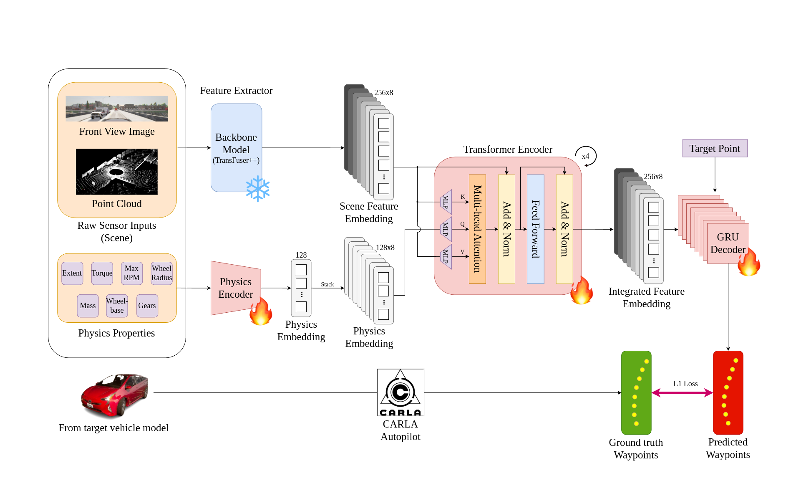

# MVAdapt: Multi-Vehicle Adaptation for End-to-End Autonomous Driving AI



## In working progress!

## Contents

## Installation

## Pre-trained Model
mvadapt.pth

mvadapt_finetuned.pth

longest6/tfpp_all_0

## Evaluation
* Parsing result
* Creating video

## Dataset

```
vehicle_index: Vehicle model index, i > 36 for randomly generated vehicle model
gt_waypoint: Ground truth waypoint for vehicle model
bs_waypoint: Predicted waypoint from baseline model for default vehicle model
gt_control: Ground truth control for vehicle model
bs_control: Predicted control from baseline model for default vehicle model
scene_features: Features that extracted by backbone model (TransFuser)
physics_params: Physical properties for vehicle model
gear_params: Gear properties for vehicle model
rgb: RGB image 
lidar_bev: LiDAR BEV image
target_point: Target heading point
ego_vel: Speed for ego vehicle
command: Command for ego vehicle
```

## Dataset Genearation

## Training

## Citations

## Acknowldgements

## Appendix

```
0 vehicle.lincoln.mkz_2017
1 vehicle.audi.a2
2 vehicle.audi.etron
3 vehicle.audi.tt
4 vehicle.bh.crossbike
5 vehicle.bmw.grandtourer
6 vehicle.carlamotors.carlacola
7 vehicle.carlamotors.firetruck
8 vehicle.chevrolet.impala
9 vehicle.citroen.c3
10 vehicle.diamondback.century
11 vehicle.dodge.charger_2020
12 vehicle.dodge.charger_police
13 vehicle.dodge.charger_police_2020
14 vehicle.ford.ambulance
15 vehicle.ford.mustang
16 vehicle.gazelle.omafiets
17 vehicle.harley-davidson.low_rider
18 vehicle.jeep.wrangler_rubicon
19 vehicle.kawasaki.ninja
20 vehicle.lincoln.mkz_2020
21 vehicle.mercedes.coupe
22 vehicle.mercedes.coupe_2020
23 vehicle.mercedes.sprinter
24 vehicle.micro.microlino
25 vehicle.mini.cooper_s
26 vehicle.mini.cooper_s_2021
27 vehicle.nissan.micra
28 vehicle.nissan.patrol
29 vehicle.nissan.patrol_2021
30 vehicle.seat.leon
31 vehicle.tesla.cybertruck
32 vehicle.tesla.model3
33 vehicle.toyota.prius
34 vehicle.vespa.zx125
35 vehicle.volkswagen.t2
36 vehicle.yamaha.yzf
```

This repo is originally from [CARLA_garage](https://github.com/autonomousvision/carla_garage)