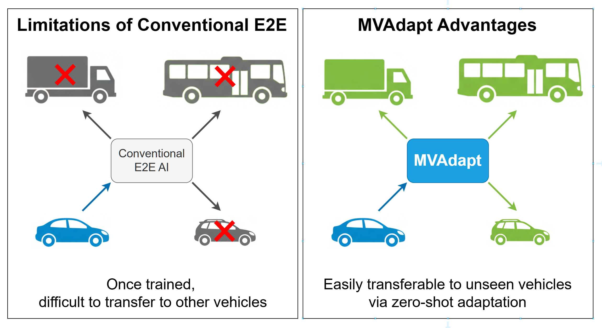
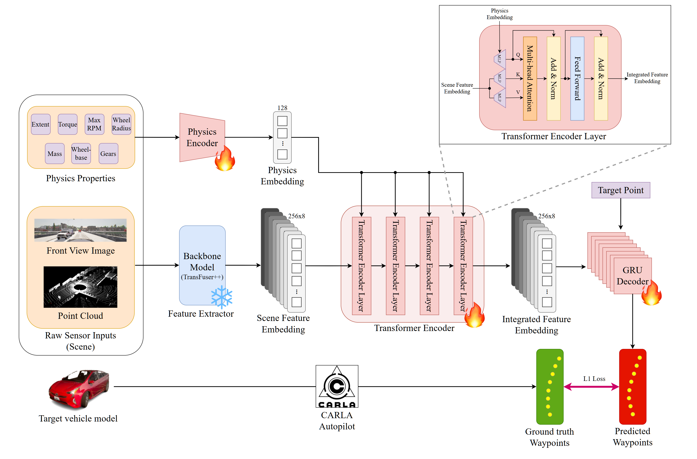

<!--  -->
<p align="center">
  
</p>

# MVAdapt: Multi-Vehicle Adaptation for End-to-End Autonomous Driving




This repository contains the official PyTorch implementation for MVAdapt. MVAdapt enables a single, pre-trained driving model to generalize across a wide range of vehicles—from nimble sports cars to heavy trucks—by conditioning its driving policy on explicit physical parameters.

This work is built upon the [CARLA Leaderboard 1.0](https://github.com/carla-simulator/leaderboard/tree/leaderboard-1.0) and is based on the [TransFuser ++ WP](https://github.com/autonomousvision/carla_garage) repository.

## 1. Contents
1. [Contents](#1-contents)

2. [Installation](#2-installation)

    2.1. [Install CARLA](#21-install-carla)

    2.2. [Apply Patched CARLA Files](#22-apply-patched-carla-files)

    2.3. [Automating the CARLA Server (Optional, Recommended)](#23-automating-the-carla-server-optional-recommended)

    2.4. [Setup Environments](#23-setup-environments)

3. [Pre-trained Model](#3-pre-trained-model)

4. [Evaluation](#4-evaluation)

    4.1. [Run Evaluation](#41-run-evaluation)

    4.2. [Parse Results](#42-parse-result)

    4.3. [Create Videos](#43-create-video)

5. [Dataset](#5-dataset)

6. [Dataset Generation](#6-dataset-generation)

7. [Training](#7-training)

    7.1. [Training from Scratch](#71-training-from-scratch)

    7.2. [Few-Shot Fine-tuning](#72-few-shot-fine-tuning)

8. [Citations](#8-citations)

[Acknowledgements](#acknowldgements)

[Appendix: Base Vehicle List](#mvadapt-multi-vehicle-adaptation-for-end-to-end-autonomous-driving)


## 2. Installation
### 2.1. Install CARLA
First, set up the [CARLA 0.9.12](https://carla.readthedocs.io/en/0.9.12/build_linux/). Follow the official documentation for a step-by-step guide. We recommend the pre-packaged version for ease of use.

* Note: CARLA 0.9.13 or higher versions may have GPU ram leak issues on every scenario termination, so we suggest to use 0.9.12 version.


### 2.2. Apply Patched CARLA Files
To ensure full compatibility with MVAdapt and safe installation, you may need to overwrite some of the original files in your CARLA installation with the modified versions provided in this repository. These patches include modifications necessary for data collection and custom functionalities.

The files inside the `MVAdapt/carla/` directory mirror the structure of the official CARLA installation. You need to copy each file from the `MVAdapt/carla/` directory to the corresponding location within your `$CARLA_ROOT` directory, overwriting the original file.

Follow this procedure:

* Navigate to the `MVAdapt/carla/` directory within this repository.

* Identify the files and their paths. For example, you will find:

    `carla/LibCarla/source/carla/Exception.cpp`

    `carla/LibCarla/source/carla/client/FileTransfer.h`

    `carla/PythonAPI/carla/agents/navigation/global_route_planner.py`

    And other files...

* For each file, copy it to the exact same relative path inside your CARLA installation directory (`/path/to/your/CARLA_0.9.12/`).

* **Rebuild the Python API**: After replacing the C++ source files (`.cpp`, `.h`), you must rebuild the CARLA Python API for the changes to take effect. Navigate to your CARLA root directory and run the following command:

```bash
cd /path/to/your/CARLA_0.9.12/
make PythonAPI
```

### 2.3. Automating the CARLA Server (Optional, Recommended)

The CARLA simulator can sometimes be unstable and may shut down unexpectedly during long data generation or evaluation sessions. To prevent this from interrupting your workflow, we provide two utility scripts that will automatically restart the server if it closes.

These scripts run an infinite loop that launches the CARLA server and waits for it to terminate. If the server process stops for any reason, the script will wait for two seconds and then start it again.

* `carla/CarlaLoop.sh`: Use this script to run the CARLA server with a display (standard graphical mode).

* `carla/Off_CarlaLoop.sh`: This script is intended for running the server in headless mode (no rendering), which is much faster and recommended for data generation.

#### How to Use
**Important**: Before running, you must edit the `$CARLA_DIST_DIR` variable inside both CarlaLoop.sh and Off_CarlaLoop.sh to point to the correct path of your CARLA installation.

```bash
# Open carla/CarlaLoop.sh and carla/Off_CarlaLoop.sh and modify this line:
CARLA_DIST_DIR='/path/to/your/CARLA_0.9.13/LinuxNoEditor'
```

Run the script from the root directory of the MVAdapt project. You can optionally specify a port.

```bash
# To run with a display
./carla/CarlaLoop.sh 2000

# To run without a display (recommended for data generation)
./carla/Off_CarlaLoop.sh 2000
```
To stop the loop and the CARLA server, simply press Ctrl+C in the terminal.

### 2.4. Setup Environments
Clone our repository and set up the Conda environment.
```bash
git clone https://github.com/hae-sung-oh/MVAdapt.git
cd MVAdapt

conda create -n mvadapt python=3.8
conda activate mvadapt
# May need to update C++ library
conda update -c conda-forge libstdcxx-ng

pip install -r requirements.txt
```
Next, configure the environment variables. Open `scripts/set_environment.sh`, and modify the `CARLA_ROOT` and `WORK_DIR` paths to match your local setup.
```bash
# scripts/set_environment.sh
#!/bin/bash

export CARLA_ROOT=/path/to/CARLA # TODO
export WORK_DIR=/path/to/MVAdapt # TODO

export PYTHONPATH=$PYTHONPATH:${CARLA_ROOT}/PythonAPI
export PYTHONPATH=$PYTHONPATH:${CARLA_ROOT}/PythonAPI/carla
export PYTHONPATH=$PYTHONPATH:$CARLA_ROOT/PythonAPI/carla/dist/carla-0.9.12-py3.8-linux-x86_64.egg
export TEAM_CODE_ROOT=${WORK_DIR}/team_code
export TEAM_CODE_MVADAPT=${WORK_DIR}/team_code_mvadapt
export SCENARIO_RUNNER_ROOT=${WORK_DIR}/scenario_runner
export LEADERBOARD_ROOT=${WORK_DIR}/leaderboard
export PYTHONPATH=$PYTHONPATH:$SCENARIO_RUNNER_ROOT:$LEADERBOARD_ROOT:$TEAM_CODE_ROOT:$TEAM_CODE_MVADAPT:$WORK_DIR
```
Activate these settings by running `source scripts/set_environment.sh`.

## 3. Pre-trained Model
We provide several pre-trained models in `pretrained_models/` folder to get you started:

* `mvadapt.pth`: The primary MVAdapt model trained on a 27 vehicles.

* `mvadapt_finetuned.pth`: A version of the MVAdapt model fine-tuned for the `Carla Cola Truck` vehicle.

* `longest6/tfpp_all_0`: The backbone TransFuser++WP model originally from [here](https://github.com/autonomousvision/carla_garage), which is not adapted for multiple vehicles.
    * You can download it [here](https://s3.eu-central-1.amazonaws.com/avg-projects-2/garage_2/models/pretrained_models.zip)
    * Unzip the zip file and place `longest6` folder to `pretrained_models/` folder.

## 4. Evaluation
To evaluate the performance of the MVAdapt model, follow these steps.

### 4.1. Run Evaluation
First, start the CARLA server in a separate terminal:
```bash
./carla/CarlaLoop.sh
```
Then, run the full evaluation script:
```bash
cd scripts/
./run_full_evaluation.sh
```
You can customize the evaluation options in the `scripts/run_full_evalutation.sh` file.
```bash
#!/bin/bash

source set_environment.sh

DATE=$(date '+%y%m%d') # Result directory name. Can be customized.
export PORT="2000"  # CARLA server port. You can run multiple evaluations by modifying here.
export TRAFFIC_MANAGER_PORT="2500" # PORT + 500 in general.

# Vehicle IDs to evaluate.
VEHICLES=(0 1 2 3 5 6 8 9 11 12 13 14 15 18 20 21 22 23 24 25 26 27 28 29 30 31 32 33 35)
export SPLIT="trained" # Folder name for in-distribution vehicles. Can be customized.

for _VEHICLE_ID in "${VEHICLES[@]}"; do
  export VEHICLE_ID=$_VEHICLE_ID
  export ADAPT=1 # Turn on MVAdapt. TransFuser++WP naive transfer if 0.
  export ADAPT_PATH="${WORK_DIR}/pretrained_models/mvadapt.pth" # MVAdapt weights path.
  export RANDOM_PHYSICS=0 # Samples physics to generate unseen vehicle if 1.
  # === Evaluation parameters ===
  export CHECKPOINT="${WORK_DIR}/result/${DATE}/${SPLIT}/V${_VEHICLE_ID}/simulation_results_${_VEHICLE_ID}_${DATE}.json" 
  export RESULT_LIST="${WORK_DIR}/result/${DATE}/${SPLIT}/V${_VEHICLE_ID}/result_list_${_VEHICLE_ID}.pickle"
  export DEBUG_PATH="${WORK_DIR}/result/${DATE}/${SPLIT}/V${_VEHICLE_ID}/debug_${VEHICLE_ID}" # Image save path.
  # =============================
  export VISUALIZE_ATTENTION=0 # Whether visualize phsics attention or not. Not fully implemented yet.
  export STREAM=1 # You can monitor the experiment.
  echo "Starting index $VEHICLE_ID"
  ./evaluate.sh
done
```


### 4.2. Parse Result
After the evaluation is complete, you can parse the results to get and save a summary of the driving metrics.
```bash
cd results/
python parse_result.py $DIRECTORY_NAME
```
### 4.3. Create Video
You can also create videos of the driving scenarios to visualize the model's performance.
```bash
cd results/
python create_video.py $DIRECTORY_NAME
```
To save the disk space, you can specify `--clear` option to delete all temporary image files.
```bash
python create_video.py $DIRECTORY_NAME --clear
```

## 5. Dataset
We provide full dataset and fine-tuning dataset. Follow the links below and unzip every zip files.
* [Full dataset](https://huggingface.co/datasets/haesungoh/MVAdapt-Dataset): Full dataset for 27 vehicles.
* [Fine-tuning dataset](https://huggingface.co/datasets/haesungoh/MVAdapt-Dataset-Mini): Mini dataset for `Carla Cola Truck`

Here is a description of the data annotations:

```
vehicle_id: Vehicle model ids
gt_waypoint: Ground truth waypoint for vehicle model
bs_waypoint: Predicted waypoint from baseline model for default vehicle model
gt_control: Ground truth control for vehicle model
bs_control: Predicted control from baseline model for default vehicle model
scene_features: Features that extracted by backbone model (TransFuser)
physics_params: Physical properties for vehicle model
gear_params: Gear properties for vehicle model
rgb: RGB image 
lidar_bev: LiDAR BEV image
target_point: Target heading point
ego_vel: Speed for ego vehicle
command: Command for ego vehicle
```

## 6. Dataset Generation
To generate new data, you can use the provided data generation script. This script will run the CARLA simulator to collect driving data from a variety of vehicles and scenarios.

Again, make sure that you launched a CARLA server on a seperate terminal. 
```bash
./carla/CarlaLoop.sh
```
And run the data generation script.
```bash
cd scripts/
./run_full_generation.sh
```
As the evaluation script, all the options in the `script/run_full_generation.sh` file are customizable.
```bash
#!/bin/bash

source set_environment.sh

export PORT="2000"  # CARLA server port.
export TRAFFIC_MANAGER_PORT="2500" # PORT + 500 in general.

# Vehicle IDs to collect.
VEHICLES=(1 2 3 5 8 9 11 12 13 14 15 18 20 21 22 23 24 25 27 28 29 30 31 32 33 35)
SCENES=(1 3 4 7 8 9) # Specific scenarios. For further information, refer to route_scenario_local.py.
TOWNS=(Town01 Town02 Town03 Town05 Town06) # CARLA towns.

for _VEHICLE_ID in "${VEHICLES[@]}"; do
    for _TOWN in "${TOWNS[@]}"; do
        for _SCENE in "${SCENES[@]}"; do
            export VEHICLE_ID=$_VEHICLE_ID
            export SCENE=$_SCENE
            export TOWN=$_TOWN
            echo "Generating data for vehicle index $VEHICLE_ID, scene $SCENE, town $TOWN"
            ./generate_data.sh
        done
    done
done

```

## 7. Training
### 7.1. Training from Scratch
To train the MVAdapt model from scratch, use the following command:
```bash
cd scripts/
./train_mvadapt.sh
```
You can specify training options in the `scripts/train_mvadapt.sh` file.
```bash
#!/bin/bash

source set_environment.sh

# === Do not modify! ===
export DIRECT=0
export AGENTCONFIG="${WORK_DIR}/pretrained_models/leaderboard/tfpp_wp_all_0"
export UNCERTAINTY_THRESHOLD=0.33
export STOP_CONTROL=0
# ======================

export VEHICLE="all" # Vehicles to train. (e.g. "[0, 1, 2]")
export ROOT_DIR="${WORK_DIR}/dataset" # Dataset path.
export BASE_MODEL=$AGENTCONFIG # Backbone feature extractor
export DEVICE="cuda:0" # CUDA device. "cpu" for CPU training.
export EPOCHS=100 # Training parameters
export LR=0.0001
export BATCH_SIZE=512
export PROCESS_BATCH=64 # Batch size for data pre-processing.
export VERBOSE=true # Log everything

export REMOVE_CRASHED=false # Remove crashed data
export REMOVE_IMPERFECT=false # Remove imperfect driving data
# export MOVE_DUP_DIR="${WORK_DIR}/dataset_backup"

# Data pre-processing for the first run. Comment out after saving processed pkl file.  
export LOAD_DATA="None"
export SAVE_DATA="${WORK_DIR}/dataset/mvadapt_dataset"
# Uncomment to load processed pkl file.
# export LOAD_DATA="${WORK_DIR}/dataset/mvadapt_dataset"
# export SAVE_DATA="None"

# Path to save trained weights.
export LOAD_MODEL="None"
export SAVE_MODEL="${WORK_DIR}/pretrained_models/mvadapt.pth"
# export LOAD_MODEL="${WORK_DIR}/pretrained_models/mvadapt.pth"
# export SAVE_MODEL="None"

python ${WORK_DIR}/team_code_mvadapt/train_mvadapt.py \
--vehicle_ids=${VEHICLE} \
--root_dir=${ROOT_DIR} \
--base_model=${BASE_MODEL} \
--device=${DEVICE} \
--epochs=${EPOCHS} \
--lr=${LR} \
--batch_size=${BATCH_SIZE} \
--process_batch=${PROCESS_BATCH} \
--save_data=${SAVE_DATA} \
--save_model=${SAVE_MODEL} \
--load_data=${LOAD_DATA} \
--load_model=${LOAD_MODEL} \
--verbose=${VERBOSE} \
--remove_crashed=${REMOVE_CRASHED} \
--remove_imperfect=${REMOVE_IMPERFECT} \
--move_dup_dir=${MOVE_DUP_DIR}
```
### 7.2. Few-shot Fine-tuning
If you want to fine-tune the model on a new vehicle with limited data, you can use the few-shot fine-tuning script:
```bash
cd scripts/
./finetune_mvadapt.sh
```
You can also modify fine-tuning parameters as well as full-training by modifiying `scripts/finetune_mvadapt.sh`.

## 8. Citations
If you find this work useful, please consider citing our paper:
```
Pending
```
## Acknowldgements
We thank to prior works below:
* [TransFuser++ WP](https://github.com/autonomousvision/carla_garage)
* [CARLA](https://github.com/carla-simulator/carla)
* [CARLA Leaderboard](https://github.com/carla-simulator/leaderboard)
* [CARLA Scenario Runner](https://github.com/carla-simulator/scenario_runner)
* [One Policy to Run Them All](https://github.com/nico-bohlinger/one_policy_to_run_them_all)
* [Body Transformer](https://github.com/carlosferrazza/BodyTransformer)

## Appendix

```
0 vehicle.lincoln.mkz_2017
1 vehicle.audi.a2
2 vehicle.audi.etron
3 vehicle.audi.tt
4 vehicle.bh.crossbike
5 vehicle.bmw.grandtourer
6 vehicle.carlamotors.carlacola
7 vehicle.carlamotors.firetruck
8 vehicle.chevrolet.impala
9 vehicle.citroen.c3
10 vehicle.diamondback.century
11 vehicle.dodge.charger_2020
12 vehicle.dodge.charger_police
13 vehicle.dodge.charger_police_2020
14 vehicle.ford.ambulance
15 vehicle.ford.mustang
16 vehicle.gazelle.omafiets
17 vehicle.harley-davidson.low_rider
18 vehicle.jeep.wrangler_rubicon
19 vehicle.kawasaki.ninja
20 vehicle.lincoln.mkz_2020
21 vehicle.mercedes.coupe
22 vehicle.mercedes.coupe_2020
23 vehicle.mercedes.sprinter
24 vehicle.micro.microlino
25 vehicle.mini.cooper_s
26 vehicle.mini.cooper_s_2021
27 vehicle.nissan.micra
28 vehicle.nissan.patrol
29 vehicle.nissan.patrol_2021
30 vehicle.seat.leon
31 vehicle.tesla.cybertruck
32 vehicle.tesla.model3
33 vehicle.toyota.prius
34 vehicle.vespa.zx125
35 vehicle.volkswagen.t2
36 vehicle.yamaha.yzf
```